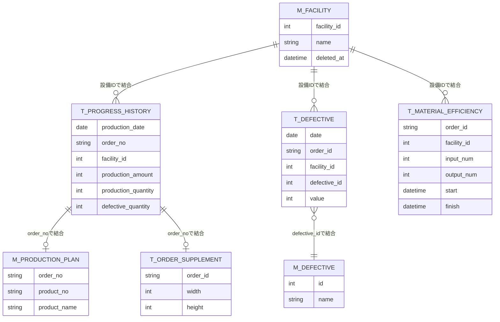

```mermaid
erDiagram
    M_FACILITY ||--o{ T_PROGRESS_HISTORY : "設備IDで結合"
    M_FACILITY ||--o{ T_DEFECTIVE : "設備IDで結合"
    M_FACILITY ||--o{ T_MATERIAL_EFFICIENCY : "設備IDで結合"

    T_PROGRESS_HISTORY ||--o| M_PRODUCTION_PLAN : "order_noで結合"
    T_PROGRESS_HISTORY ||--o| T_ORDER_SUPPLEMENT : "order_noで結合"

    T_DEFECTIVE }o--|| M_DEFECTIVE : "defective_idで結合"

    M_FACILITY {
        int facility_id
        string name
        datetime deleted_at
    }

    T_PROGRESS_HISTORY {
        date production_date
        string order_no
        int facility_id
        int production_amount
        int production_quantity
        int defective_quantity
    }

    M_PRODUCTION_PLAN {
        string order_no
        string product_no
        string product_name
    }

    T_ORDER_SUPPLEMENT {
        string order_id
        int width
        int height
    }

    T_DEFECTIVE {
        date date
        string order_id
        int facility_id
        int defective_id
        int value
    }

    M_DEFECTIVE {
        int id
        string name
    }

    T_MATERIAL_EFFICIENCY {
        string order_id
        int facility_id
        int input_num
        int output_num
        datetime start
        datetime finish
    }
```
